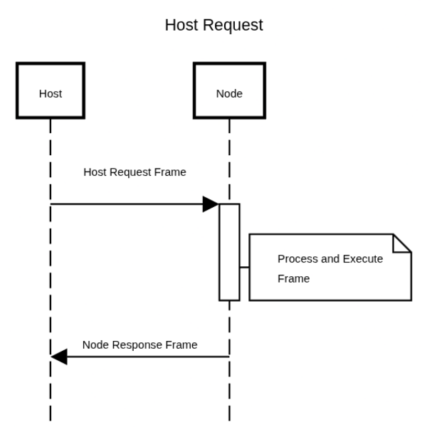
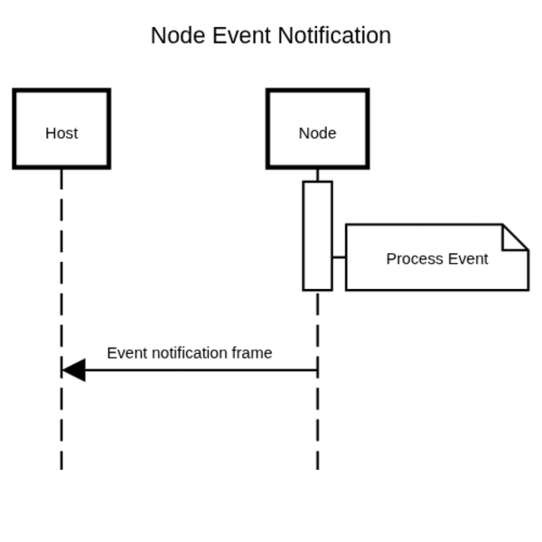
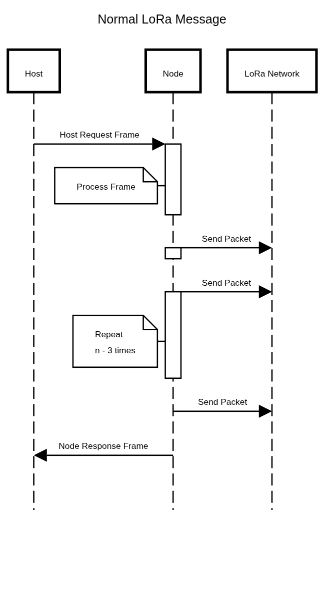
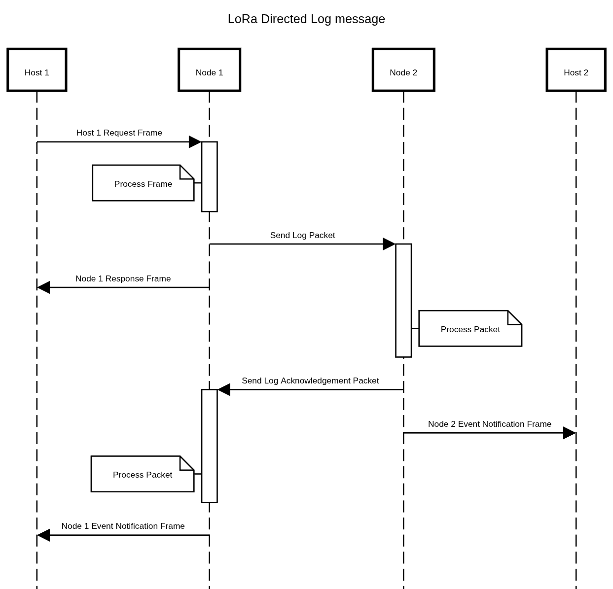

# Communications

Communication with an Ares LoRa node and the host computer is carried out over USB. Node-to-node communication
is carried out over LoRa. The USB uses [Ares Frames](ares-frame.md) to communicate while the LoRa use 
[Ares Packets](ares-packet.md) to communicate.

## Serial Protocol

When communicating over serial, there are two things that can happen:

1. The host sends a frame to the node
2. The node sends the host an event notification

In the event that the host sends a frame to the node, the node will respond or acknowledge to the frame it received
after running its routine to process it. On the other hand, the node can send the host event notifications, which can
be sporadic. The node does not expect a response from the host when sending these event notifications.

|                                                                    |                                                           |
|:------------------------------------------------------------------:|:---------------------------------------------------------:|
|  |  |

## LoRa Protocol

When a node is communicating over LoRa, it can either broadcast a packet over the network a specified amount of times,
or it can send a message directly to another node. The only time when broadcasting should be used is when a node
needs to send a message to every node that is listening. The LoRa communication protocol for direct messages does
not enforce acknowledgement messages, however, for directed messages, some acknowledgement is recommended.

|                                                                        |                                               |
|:----------------------------------------------------------------------:|:---------------------------------------------:|
|                |  |
