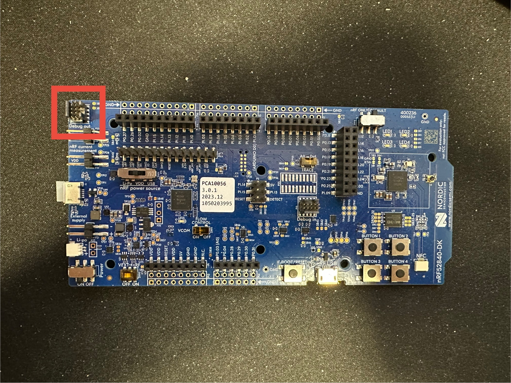
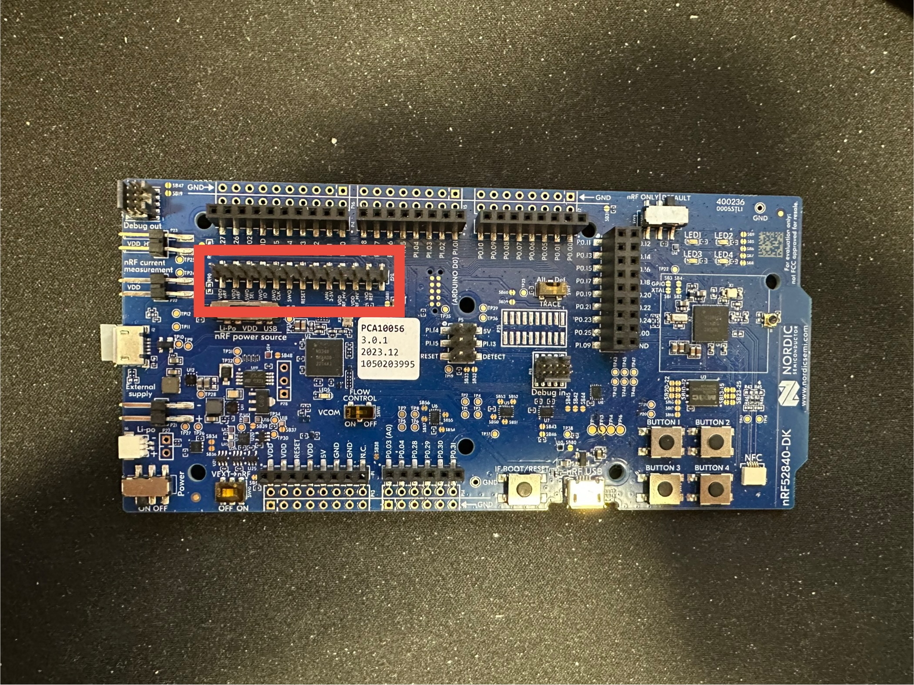

Flashing a microcontroller is fairly straight forward. There are two methods in doing so: JTAG and over serial. Often
times, things are flashed over JTAG first and the devices are flashed over serial after that. This page describes how 
to do both methods.

## Flashing over JTAG

Flashing a microcontroller over JTAG is fairly straight forward if you are using a JLink programmer or the on-board
JLink microcontroller on a devkit. However, not all devkits come with the means to flash a microcontroller over JTAG
easily. This section will describe how to program a microcontroller over JTAG using the [nRF52840 DK](https://www.nordicsemi.com/Products/Development-hardware/nRF52840-DK).
These instructions can also be applied to other Nordic development kits.

### Getting the devkit ready

The devkit has 3 JTAG ports. There is the one that is connected to the evaluation microcontroller and is inaccessible.
The second port is connected to a "Debug Out" header in the corner of the board (you may have to look for it if using
different dev kit). If using the second port, just connect your cable and you are done. 



The third port are normal headers that jumper wires can be connected to. __In order to use this port__, the `SWD SEL` 
needs to be tied to `VDD nRF`. This will disable port 2, but enable port 3.



### Flashing

After getting things set up on the hardware, things should be easy to flash over JTAG.

=== "VS Code"

    If you are using VS code, all you have to do is press the "Flash" button and select the devkit to flash to (usually 
    something like nRF52840 DK).

=== "CLI"

    If you are using the CLI, you want to run the following commands:

    ```{.bash .copy}
    $ cd firmware
    $ nrfutil sdk-manager toolchain launch --ncs-version v3.2.2 --shell
    $ source <path to ncs directory>/v3.2.2/zephyr/zephyr-env.sh
    $ west flash -d $(pwd)/<build directory>
    ```

=== "nRF Connect Desktop App"

    For flashing a microcontroller with an image downloaded from GitHub releases, it is recommended to use this method.
    
    1. Open desktop application
    2. Open the "Programmer" app
    3. Press "Select Device" and select the nRF devkit
    4. Press "Add file" and add "merged.hex"
    5. Press "Erase & Write"

## Flashing over USB

The other method for flashing is over USB and is used for upgrading the firmware. To flash the microcontroller over USB,
it is recommended that the [Device Firmware Upgrade API](../serial-driver/python-api/dfu.md) is used in the serial 
driver. a few basic steps just need to be followed:

1. Find the correct USB port used for DFU.
2. Create a new `AresDfu` instance.
3. Upload the signed hex file to the microcontroller.
4. Reset the microcontroller (it should take a few seconds to swap images).
5. Test the image to make sure things are not crashing.
6. Confirm the image.

Below is an example program:

``` {.python .copy}
from ares_lora import AresDfu, find_ports

def find_dfu_port() -> Path:
    ports = find_ports()
    ...
    return port

# Upload the image and run the image
port = find_dfu_port()
dfu = AresDfu(port)
dfu.upload("build/.../zephyr.signed/hex")
dfu.reset_mcu(True)

# Confirm the image
input("Press enter to confirm image...")
# Ports may have changed...
port = find_dfu_port()
dfu = AresDfu(port)
dfu.confirm_image()
```
