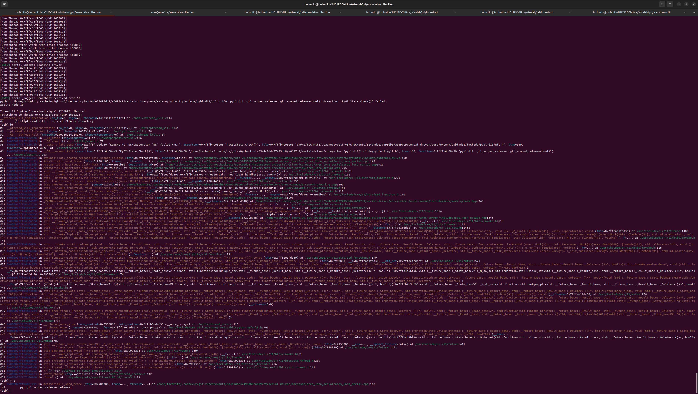

# Debugging Tips for the Serial Driver

Sometimes something will go wrong in the serial driver. If it occurs in the Python API, then it should be simple to 
figure out with standard Python debugging strategies. However, if the core library (C++ bindings) needs to be debugged, 
then it becomes a little more tedious. Below are some strategies for debugging the core library.

## Logging

The core library has a logger built into the library. By default, the library sends its output to stdout directly and
the default debug level can be modified in the `pyproject.toml`. Below is a snippet in the toml for modifying the 
default log level.

``` {.toml .copy}
[tool.scikit-build]
cmake.args = ["-DDEFAULT_LOG_LEVEL=off"]

# dbg => Debug level and higher
# inf => Info level and greater
# wrn => Warning level and greater
# err => Error level and greater
# crit => Critical level
# off => Logging turned off
```

### Modifying the log level during runtime

The log level can also be modified during runtime through the 
[Python API](python-api/serial_driver.md#ares_lora.LoraSerial.set_logging_level). Just note, if the log level is 
modified for one instance, it will modify the log level for all the instances since it is a module level logger. In
addition to the log level being adjusted during runtime, the logs can also be redirected towards a Python logger by
calling the [redirect logger method](python-api/serial_driver.md#ares_lora.LoraSerial.register_logger).

## GDB

For logic errors and error codes, logging is a viable option for debugging. However, for other cases, logging may not
be an effective way to debug. Another way to debug is with GDB. Before debugging with GDB, a test script should be 
written to replicate the bug and the core library should be built with debug optimizations and symbols enabled in 
the `pyproject.toml` as follows:

``` {.toml .copy}
[tool.scikit-build]
cmake.build-type = "Debug"
```

Once that is done, run the following commands to debug with GDB:

``` {.shell .copy}
gdb -q <path to python executable>
# Add any breakpoints if needed.
r <path to test.py>
```

<figure markdown="span">
    
    <figcaption>Example GDB Trace</figcaption>
</figure>
