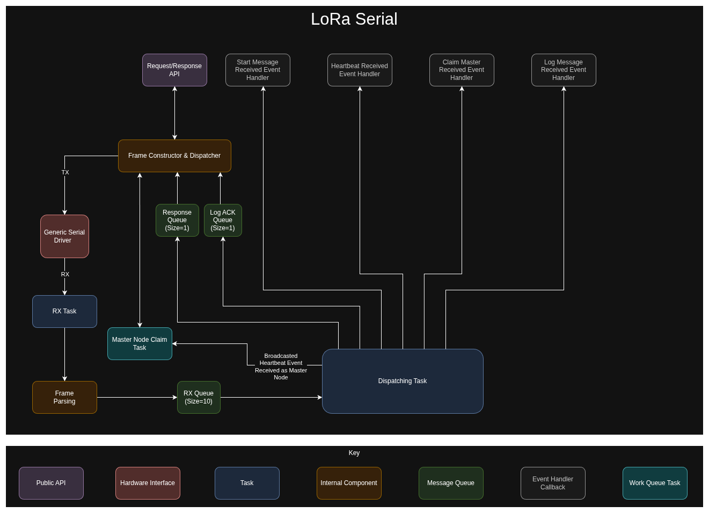

# Serial Driver

There is a dedicated serial driver written to communicate with an Ares LoRa node. This driver is constructed in C, C++,
and Python, and it only works in Linux. The core of the driver is written in C and C++, and applications written in C
or C++ can use the code driver (not implemented yet). The public interface for the driver is written in Python and can
be installed with running the following installation command in the root of the repo:

``` { .bash .copy }
cd serial-driver/core && pip install . && cd .. && pip install . && cd ..
```

## Architecture

The serial driver has a public facing Request/Response API. This API will send requests to the hardware node and handle
the responses from the node. The APIs that use the LoRa modem will have a timeout parameter. This is because the
LoRa requests take a lot longer to respond than the normal requests. In addition to the response/request API, the
driver also has event callbacks for events that may be received from the node. 

### Master Node

The serial driver behaves differently depending on if the node is designated as a master or not. If the node is 
designated as a master, then the serial driver will send out claim master messages if it receives a broadcasted
heartbeat message. Additionally, the master node will not be able to send out heartbeat messages.

When a non-master node receives a claim master message, it will relay the master ID to the serial driver, and the
serial driver will direct all its heartbeat messages to the master node. Additionally, if log messages are supposed
to be direct and the destination ID is not set, then the serial driver for non-master nodes will direct log messages
to the master node.



!!! warning

    The events are dispatched from a C++ thread. If the event handlers on the Python side touch shared memory,
    a mutex needs to be used since the GIL (Global Interpreter Lock) is not used.
